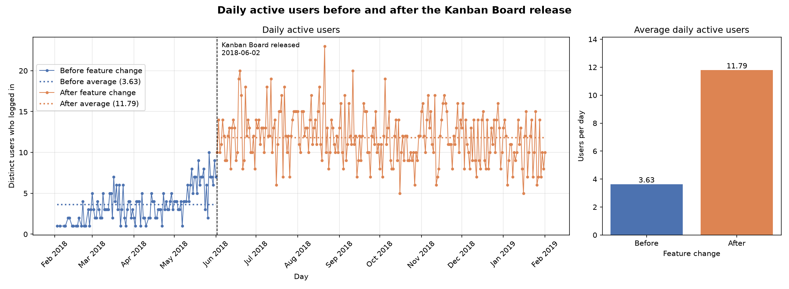
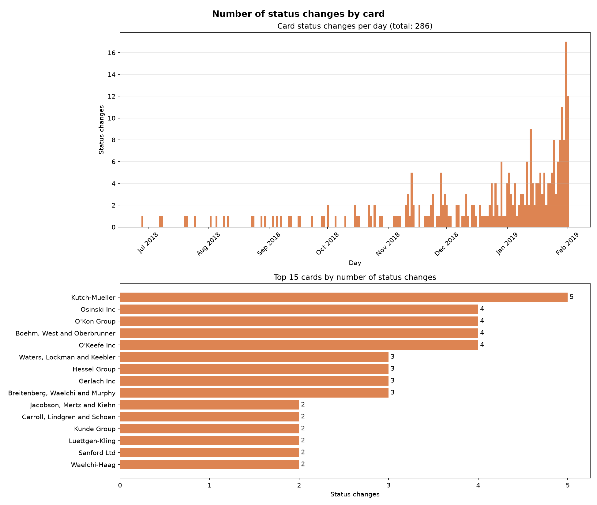

# Kanban Board: how it's doing and what I'd build next

It's been a while since we launched the Kanban Board (2 June 2018), so I dug into the login and card history to see what it actually changed. Short version: it worked really well at first, but the gains are starting to fade. I've got three ideas at the end for getting daily active users moving up again.

If you want to check my work, the queries are in [answer.sql](answer.sql). The raw outputs are in the [results](results/) folder, and the charts were made from those with [make_charts.py](make_charts.py).

A couple of things about how I counted. I treated anyone who logged in at least once on a given day (UTC) as a daily active user. For status changes, I only counted rows in `card_change_history` where the card actually went from one status to a different one. Rows with no old status are just new cards being created, so I skipped those.

## Did the board bring people back?

Yes, and by a lot.



Before the launch we were getting about 3.6 users a day on average. After it, that jumped to nearly 12. Only 38 of our 100 users had logged in during the months before launch. Afterwards, 99 of them did. Total logins went from 488 to 3,572, although the "after" period is also about twice as long (245 active days vs 110).

What bothers me is the trend since then. Daily users peaked in July at around 12.9 and have mostly been sliding: 12.0 in September, 10.5 in October, a bump to 12.6 in November, then 11.3 in December and 10.2 in January. It's not a collapse, but it's heading the wrong way.

One caveat: days where nobody logged in don't appear in the data, so these averages only cover days with at least one login.

## How are people using the board?



There have been 286 status changes across our 200 cards, all after launch. None of the cards gets moved very often. The most-moved one, Kutch-Mueller, has only changed status five times, and 38 cards have never moved at all.

The moves mostly go the way you'd hope. 167 cards went from backlog to in progress, and 103 went from in progress to complete. Only 16 went backwards.

Two things jumped out at me here.

First, the busy people are getting busier. We had 47 status changes in December and 149 in January, more than triple, while daily users actually dropped. So a smaller group is doing a lot more of the work.

Second, a big chunk of the board has gone quiet. As of the last day in the data (1 Feb 2019) there were 102 unfinished cards, 44 in backlog and 58 in progress. 72 of those hadn't been touched in over a month.

## Ideas

### Idea 1: Let people know when their shipments move

**Hypothesis:** At the moment, the only way to find out a card has moved is to open the board and look. If you're not the person moving cards, there isn't much pulling you back in. I think if we just told people when something they care about changed, a lot more of them would check in each day.

**Expected impact:** I'd hope this gets us back past the July high of about 13 daily users, and I don't think 15 is out of reach within a couple of months. We could see whether it's working by tracking how many people log in from the digest email, and by rerunning the daily users query.

**What the feature is:** You can "watch" a card, and you're automatically watching anything you created or are assigned to. When one of those cards changes status or priority, you get a notification. Each morning there's also a short email listing what moved the day before, with a button that opens the board showing just your cards.

Rough sketch of the morning email:

```
+---------------------------------------------+
| Morning! 5 of your shipments moved          |
|                                             |
|  Kutch-Mueller    in progress -> complete   |
|  Osinski Inc      in progress -> complete   |
|  O'Kon Group      backlog -> in progress    |
|  Hessel Group     backlog -> in progress    |
|  Gerlach Inc      in progress -> backlog    |
|                                             |
|  2 cards need you today                     |
|           [ Open my board ]                 |
+---------------------------------------------+
```

How it flows: card moves, watchers get notified, the digest goes out at 8am, and the link opens the board filtered to "My cards".

### Idea 2: Make moving cards quicker

**Hypothesis:** Our users moved more than three times as many cards in January as in December, even though fewer of them were logging in. And they're still dragging every card across one at a time. That gets old fast. If we make moving a batch of cards quick and easy, I think we're much less likely to lose these users, and the board will feel less like a chore to new ones.

**Expected impact:** More status changes per person and less time spent per move. Ideally a keyboard shortcut would make a move take under two seconds. If it keeps our heaviest users around, I'd guess we could see something like a 10 to 15% lift in daily users. We can measure it with the status change queries, plus a count of how many moves use the new options.

**What the feature is:** Mostly small quality-of-life fixes. You'd be able to tick several cards (or shift-click them) and move them all together. Each card would get a little "Move to" menu, so you don't have to drag. Power users get shortcuts: J and K to move between cards, and 1, 2 or 3 to send a card to backlog, in progress or complete. After every move, an Undo button shows up for a few seconds, since people do occasionally move the wrong card (16 of the 286 moves went backwards).

Rough sketch:

```
+-----------------------------------------------------------+
| 3 selected   [Move to v]  [Set priority v]  [Clear]       |
+-------------------+-------------------+-------------------+
| BACKLOG (44)      | IN PROGRESS (58)  | COMPLETE (98)     |
| [x] Leuschke Grp  | [ ] Osinski Inc ..| [ ] Kunde Group   |
| [x] Jacobson...   | [ ] O'Kon Group ..| [ ] Sanford Ltd   |
| [x] Russel...     |    +-----------+  |                   |
| [ ] ...           |    | Move to:  |  |                   |
|                   |    | Backlog 1 |  |                   |
|                   |    | Complete 3|  |                   |
|                   |    +-----------+  |                   |
+-------------------+-------------------+-------------------+
| 3 cards moved to In progress                     [Undo]   |
+-----------------------------------------------------------+
```

### Idea 3: Point out what's stuck

**Hypothesis:** 72 unfinished cards haven't moved in over a month, and 38 have never moved at all. I doubt anyone is ignoring them on purpose. They probably just get lost among everything else on the board. If the app opened with a short "here's what needs you today" list, people would have an actual reason to log in, and those shipments would start moving again.

**Expected impact:** Within about a month, I'd like to see the number of cards sitting idle for 30+ days go from 72 to under 30. Longer term, if checking the list becomes a daily habit, it should also help nudge daily users toward 15. We'd keep an eye on the idle card count, how often people open the Today panel, and the usual queries.

**What the feature is:** Any card that hasn't moved in a while gets a small "stuck" badge on the board. High-priority cards get flagged sooner. At the top of the board there'd be a Today panel listing those cards along with anything urgent. From there you can move a card, hand it to someone else, or snooze it for a day. Stuck cards would also show up in the morning email from idea 1, so the two ideas support each other.

Rough sketch:

```
+-----------------------------------------------------------+
| TODAY: 6 cards need attention             [Snooze all 1d] |
|  Carroll, Lindgren...  in progress  34 days  [Move] [...] |
|  Luettgen-Kling        backlog      41 days  [Move] [...] |
|  Waelchi-Haag          in progress  30 days  [Move] [...] |
|  Kutch-Mueller         priority 1   due soon [Open]       |
+-------------------+-------------------+-------------------+
| BACKLOG           | IN PROGRESS       | COMPLETE          |
| Luettgen-Kling    | Carroll, Lind...  | Kunde Group       |
|   (41d idle)      |   (34d idle)      |                   |
+-------------------+-------------------+-------------------+
```

(The names and day counts in the sketches are made up for illustration.)

## Rerunning any of this

Run [answer.sql](answer.sql) against `shiptivity.db`, save each result as a CSV in `results/`, then run `python make_charts.py` to redraw the charts. You'll need matplotlib for that last step.
